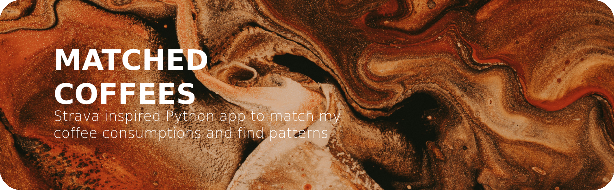
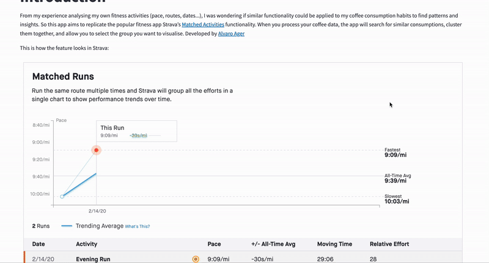

# Matched Coffees
From my experience analysing my own fitness activities (pace, routes, dates...), I was wondering if similar functionality could be applied to my coffee consumption habits to find patterns and insights. So this app aims to replicate the popular fitness app Strava’s [Matched Activities](https://support.strava.com/hc/en-us/articles/216918597-Matched-Activities/) functionality. When you process your coffee data, the app will search for similar consumptions, cluster them together, and allow you to select the group you want to visualise. Developed by [Alvaro Ager](https://www.linkedin.com/in/alvaroager/)

### Application
Access to Streamlit app [here](https://matched-coffees.streamlit.app/)

